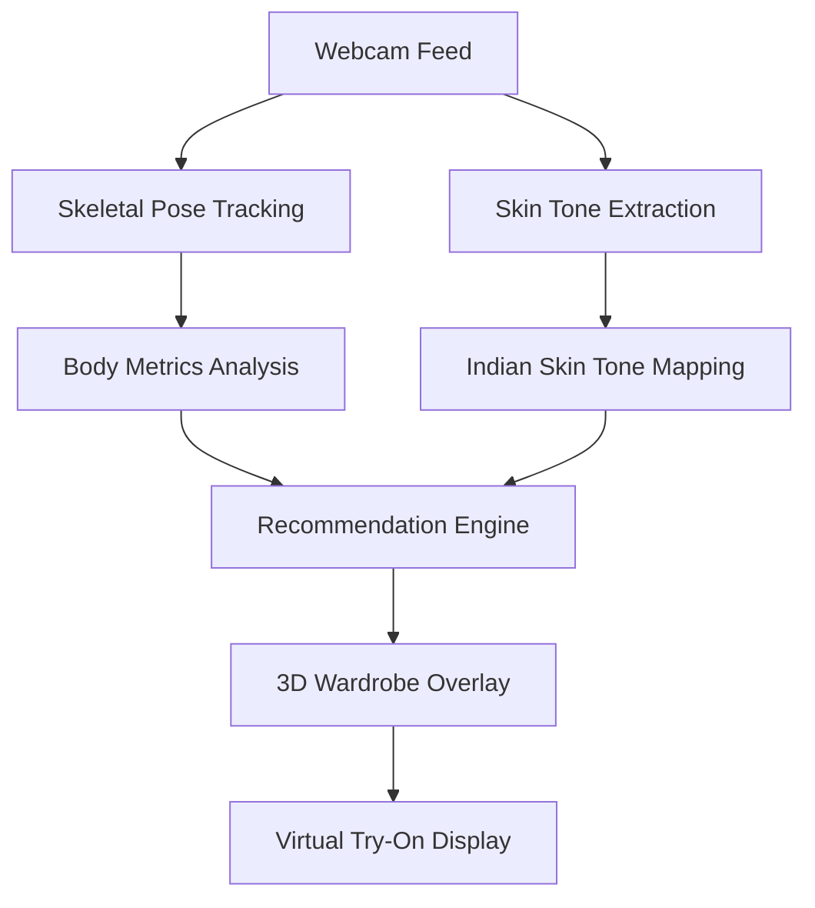

# FashionVision AI

Premium, high-fidelity AI Fashion Assistant (Virtual Mirror) that uses Computer Vision to determine physical attributes and provide virtual try-on recommendations.

## 🚀 AI Pipeline



## 🛠 Tech Stack
- **Frontend**: React 19, Vite, Three.js, Vanilla CSS
- **Backend**: FastAPI (Python), WebSockets
- **AI/CV**: MediaPipe, OpenCV, NumPy
- **Design**: Premium Glassmorphism (Gold & Black)

## 📂 Structure
- `/frontend`: React dashboard and 3D mirror.
- `/backend`: API and WebSocket server.
- `/ai_models`: Pose detection and skin analytics core.

## 🏃 Run Instructions
1. **Backend**:
   ```bash
   cd backend
   pip install -r requirements.txt
   python main.py
   ```
2. **Frontend**:
   ```bash
   cd frontend
   npm install
   npm run dev
   ```
